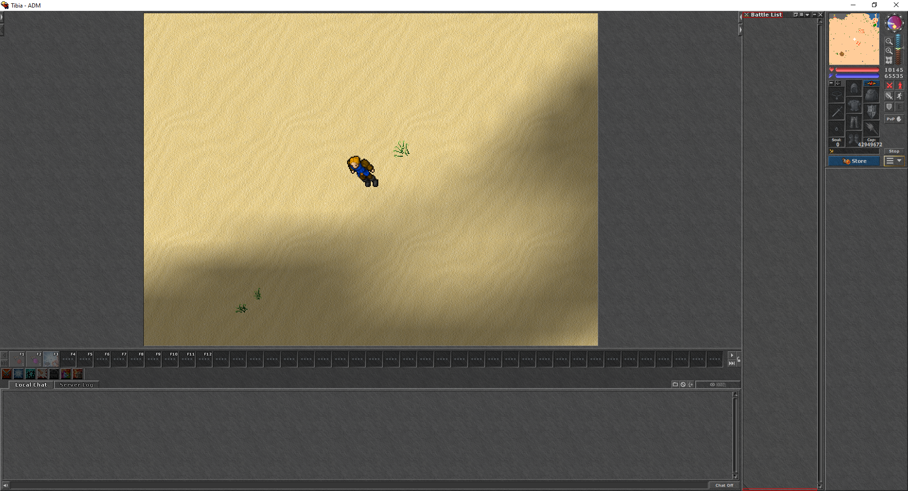

# 📝 Description

> This module detects the battle list to get avaible creatures to hunt.

# Finding battle list

The first thing to find is the top of the battle list.
The second thing to find is the bottom of the battle list.



## Checking for enough space

Since the height of each creature slot is 20, the minimum required to start detecting monsters is 20.

## Converting content to black

Gray noise in the background is removed to make work easier, so all gray range between [50:100] is converted to black(0).

# Creature slot

Each slot dimension is 156x20. The cropped image to detect a single monster is showed below:


## Croping name to get monster hash

To detect monster name is necessary to crop only the name area like the image below:


Once the name area is cropped, a hash will be generated to access creatures dict variable to get the correct creature.

```python
currentCreatureHash = ...
dragonLord = creatures[currentCreatureHash]
```
